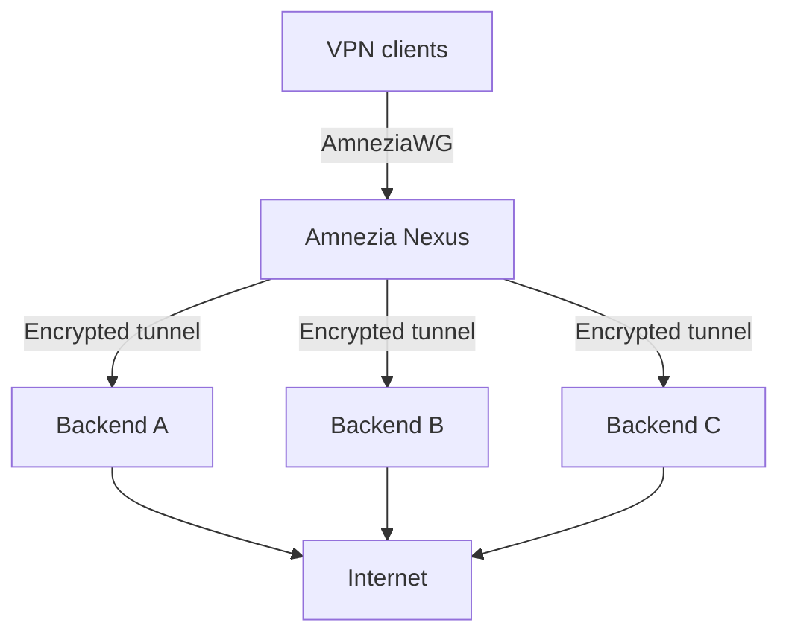

<p align="center">
  
</p>

<h1 align="center">Amnezia Nexus</h1>

<p align="center"><strong>One VPN address for your users. Multiple servers behind it.</strong></p>

<p align="center">A self-hosted VPN gateway and web panel for AmneziaWG.</p>

<p align="center">
  <a href="https://github.com/devops-igor/amnezia-nexus/actions/workflows/ci.yml"></a>
  <a href="https://github.com/devops-igor/amnezia-nexus/actions/workflows/docker.yml"></a>
  <a href="https://github.com/devops-igor/amnezia-nexus/releases/latest"></a>
  <a href="https://github.com/devops-igor/amnezia-nexus/pkgs/container/amnezia-nexus"></a>
  <a href="https://github.com/devops-igor/amnezia-nexus/blob/main/go.mod"></a>
</p>

<p align="center">
  <a href="#quick-start">Quick Start</a> ·
  <a href="#features">Features</a> ·
  <a href="#how-it-works">How It Works</a> ·
  <a href="#documentation--specifications">Documentation</a> ·
  <a href="https://github.com/devops-igor/amnezia-nexus/releases">Releases</a>
</p>


Amnezia Nexus lets your users connect to one VPN address while you manage the servers behind it. You can split traffic across several backends, check which ones are working, and switch away from a failed server.

Normally, you can replace or add backend servers without asking users to import new VPN configs.

> [!NOTE]
> Amnezia Nexus is an independent, non-commercial hobby project built for personal use and friends. It is not affiliated with or endorsed by Amnezia VPN or the AmneziaWG developers.

## Why use Nexus?

A VPN server can stop working for all sorts of reasons. It might go offline, or its IP address might get blocked. If everyone connects directly to that server, moving to a new one often means sending out new config files to every user.

Nexus puts a gateway between your users and your exit servers. Users connect to the gateway. Nexus sends their traffic through separate AmneziaWG tunnels to your backend servers, which then connect to the internet.

You can host the gateway and backends in different networks. This is useful in places where foreign VPN server addresses are often blocked. Nexus checks backend health and can switch traffic to another working server when one fails.

There are limits. A blocked gateway can still leave users disconnected, and a backend switch can interrupt existing sessions.

## Features

| Feature | What it does |
| --- | --- |
| Load balancing | Spread traffic across backends using least connections, sticky sessions, or round robin. |
| Automatic failover | Check backend health and avoid servers that stop responding. |
| Stable client configs | Add or replace backend servers without routinely giving users new VPN profiles. |
| AmneziaWG 3.x | Use the protocol's obfuscation options, including protected headers, configurable handshake parameters, and junk padding. |
| Web panel | Add servers over SSH, manage VPN users, and get configuration files or QR codes. |
| VPN diagnostics | See backend health, client traffic, packet loss, and other data that helps with troubleshooting. |
| Docker images | Run Nexus on Linux AMD64 or ARM64 using images from GitHub Container Registry. |
| DNS | Use the included AdGuard DNS defaults or configure your own. |

## How it works



1. A user connects to Nexus with an AmneziaWG profile.
2. Nexus chooses a backend based on your load-balancing settings and the backend's health.
3. The backend sends traffic out to the internet through its own connection.
4. If a backend stops working, Nexus can use another one. Some connections may need to reconnect.

You manage users and backend servers from the web panel. For the technical details, including `amneziawg-go`, VirtualTUN, and packet routing, see [Architecture & How It Works](useful_notes/HOW_IT_WORKS.md).

## Quick start

> [!IMPORTANT]
> Set up your Linux host first. [Server Preparation](#server-preparation) covers forwarding, firewall rules, and Docker. The example below exposes the web panel over **HTTP on port 8080**. Keep that port on a trusted network during setup, and use HTTPS through a reverse proxy before making the panel publicly accessible.

### 1. Create a `docker-compose.yaml`

Make a directory for Nexus:

```bash
mkdir -p ~/amnezia-nexus && cd ~/amnezia-nexus
```

Create `docker-compose.yaml` with the following contents:

```yaml
services:
  amnezia-panel:
    image: ghcr.io/devops-igor/amnezia-nexus:v2.2.0
    container_name: amnezia-panel
    restart: unless-stopped
    ports:
      - "8080:5000"           # Web panel
      - "51820:51820/udp"     # VPN port
    volumes:
      - panel-data:/app/data
    environment:
      - PORT=5000
      - DATA_DIR=/app/data
      - LOG_LEVEL=INFO
      - VPN_ENABLED=true
      - VPN_LISTEN_PORT=51820
      - VPN_SUBNET=10.100.0.0/16
    healthcheck:
      test: ["CMD", "curl", "-sf", "http://127.0.0.1:5000/api/health"]
      interval: 15s
      timeout: 5s
      retries: 3
      start_period: 10s

volumes:
  panel-data:
```

### 2. Start Nexus

The example uses version `v2.2.0` (Voyager). Check [Releases](https://github.com/devops-igor/amnezia-nexus/releases/latest) for the latest stable version. The `:latest` image follows `main`, so it may contain changes that have not been released yet. You can find the available tags on [GHCR](https://github.com/devops-igor/amnezia-nexus/pkgs/container/amnezia-nexus).

```bash
docker compose up -d
```

To watch the startup logs:

```bash
docker compose logs -f amnezia-panel
```

Once Nexus starts, its health endpoint should respond and the VPN listener should be running on port `51820`.

## Setting up your VPN

1. Open `http://<YOUR_SERVER_IP>:8080` and create your admin account.
2. Go to **Servers > Add Server**. Enter the address, SSH port, and credentials for your remote server.
3. Open **VPN > Add Backend**, select the server, and choose **Enable Backend**. Nexus will connect to it, check its AmneziaWG container, set up NAT forwarding rules, and add it to the backend pool.
4. Go to **Clients > Create Client**. Download a `.conf` file or scan the QR code in the Amnezia VPN mobile app.

## Server preparation

Before starting Nexus on Ubuntu, Debian, or another Linux distribution, configure the host so it can forward VPN traffic. Only open the ports your setup needs, and keep the web panel restricted to trusted networks.

### 1. Enable IP forwarding

Run these commands on the host:

```bash
sudo tee /etc/sysctl.d/99-nexus.conf << 'EOF'
# Allow packet forwarding
net.ipv4.ip_forward = 1
net.ipv6.conf.all.forwarding = 1

# Loose reverse path filtering (prevents the kernel from dropping return packets on asymmetric paths)
net.ipv4.conf.all.rp_filter = 2
net.ipv4.conf.default.rp_filter = 2
EOF

sudo sysctl --system
```

Check the setting:

```bash
sysctl net.ipv4.ip_forward
# Should return: net.ipv4.ip_forward = 1
```

The `rp_filter = 2` setting allows loose reverse-path filtering. Strict filtering can drop legitimate VPN traffic if the return route uses a different interface.

### 2. Configure the firewall

Use the rules that match your host's firewall.

#### UFW

Edit `/etc/default/ufw` and set:

   ```bash
   DEFAULT_FORWARD_POLICY="ACCEPT"
   ```

Then open the required ports and reload UFW:

   ```bash
   sudo ufw allow 80/tcp     # HTTP (or for reverse proxy)
   sudo ufw allow 443/tcp    # HTTPS
   sudo ufw allow 8080/tcp   # Web panel (if accessing directly)
   sudo ufw allow 51820/udp  # VPN listener port
   sudo ufw reload
   ```

Only open the web panel port to trusted networks. If you use a reverse proxy, you may not need to expose `8080` publicly.

#### iptables

Find the host's internet interface, enable forwarding for return traffic, and set up NAT:

```bash
WAN_IFACE=$(ip route get 1.1.1.1 | awk '{print $5; exit}')

# Allow forwarded traffic
sudo iptables -A FORWARD -m conntrack --ctstate RELATED,ESTABLISHED -j ACCEPT

# Enable NAT masquerade so packets leave with the server's public IP
sudo iptables -t nat -A POSTROUTING -o "$WAN_IFACE" -j MASQUERADE

# Save rules so they survive a reboot
sudo apt-get install -y iptables-persistent && sudo netfilter-persistent save
```

### 3. Install Docker

Install Docker Engine and the Docker Compose plugin using the [official Docker instructions](https://docs.docker.com/engine/install/) for your Linux distribution.

> [!NOTE]
> Users in the `docker` group effectively have root access to the host. Read the [Docker post-install guide](https://docs.docker.com/engine/install/linux-postinstall/) before adding anyone to that group. You can also run Docker commands with `sudo`.

## Configuration

Set these environment variables in your `docker-compose.yaml` when you need to change the defaults.

| Variable | Default | Description |
| :--- | :--- | :--- |
| **`VPN_ENABLED`** | `false` | Set to `true` to enable the built-in AmneziaWG VPN load balancer. |
| **`VPN_LISTEN_PORT`** | `51820` | UDP port Nexus listens on for client VPN connections. |
| **`VPN_SUBNET`** | `10.100.0.0/16` | Private IPv4 subnet used for VPN clients. |
| **`VPN_PUBLIC_ENDPOINT`** | *(auto-detected)* | Public domain or IP, such as `vpn.example.com:51820`, added to client configs. You can also set this in the web panel. |
| **`PORT`** | `5000` | Port for the web panel and API inside the container. |
| **`HOST`** | `0.0.0.0` | Address the web server listens on. |
| **`LOG_LEVEL`** | `INFO` | Log level: `DEBUG`, `INFO`, `WARN`, or `ERROR`. |
| **`SECRET_KEY`** | *(auto-generated)* | 64-character hex key used to encrypt sessions and credentials. If unset, Nexus generates one on first startup and saves it in `DATA_DIR/.secret_key`. |
| **`TRUSTED_PROXIES`** | *(empty)* | Trusted proxy IPs or CIDRs, such as `127.0.0.1, 10.0.0.0/8`, allowed to supply the original client IP through `X-Forwarded-For`. |
| **`DATA_DIR`** | `/app/data` | Directory for the database, secret key, and backups. |
| **`DB_PATH`** | `<DATA_DIR>/panel.db` | Path to the SQLite database. |

### HTTPS behind a reverse proxy

If nginx, Caddy, BunkerWeb, or another proxy handles HTTPS and forwards HTTP to Nexus, set `TRUSTED_PROXIES` to the proxy's IP address or network range:

```bash
TRUSTED_PROXIES=10.0.0.0/8        # or the exact proxy IP, e.g. 172.18.0.1
```

Nexus then accepts `X-Forwarded-Proto: https` only from trusted proxies and marks session cookies as `Secure`. It ignores that header from other connections. When Nexus handles HTTPS itself, cookies are marked `Secure` automatically.

`COOKIE_INSECURE=1` disables secure cookies. Use it only for local development.

## Documentation & specifications

- [Architecture & How It Works](useful_notes/HOW_IT_WORKS.md): How the userspace data plane, VirtualTUN, and packet routing work.
- [Changelog](CHANGELOG.md): Changes and fixes from previous versions.
- [Releases](https://github.com/devops-igor/amnezia-nexus/releases): Stable versions and release notes.
- [End-to-end testing](tests/e2e/README.md): How to run the browser and VPN lifecycle tests.
- [Differential and soak testing](scripts/DIFFERENTIAL_SUITE_RUNBOOK.md): Extended reliability tests.
- [CI workflows](https://github.com/devops-igor/amnezia-nexus/actions): Build, test, lint, and security check runs.
- [Container images (GHCR)](https://github.com/devops-igor/amnezia-nexus/pkgs/container/amnezia-nexus): Published Docker images and tags.

## Issues and security

If you find a bug or have an idea for a feature, [open an issue](https://github.com/devops-igor/amnezia-nexus/issues). Include the steps to reproduce the problem and any logs that might help.

Before posting logs or configurations, remove private keys, passwords, tokens, and other personal or sensitive information.

The repository does not currently include a license. Check the licensing status before copying or redistributing the code.
