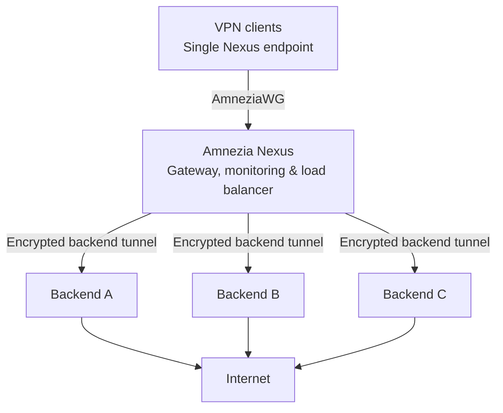

<div align="center">


# Amnezia Nexus

**One VPN entry point. Multiple backend servers. Automatic failover.**

Self-hosted AmneziaWG VPN gateway and management platform for resilient, centrally managed connectivity.

[](https://github.com/devops-igor/amnezia-nexus/actions/workflows/ci.yml)
[](https://github.com/devops-igor/amnezia-nexus/actions/workflows/docker.yml)
[](https://github.com/devops-igor/amnezia-nexus/releases/latest)
[](https://github.com/devops-igor/amnezia-nexus/pkgs/container/amnezia-nexus)
[](https://github.com/devops-igor/amnezia-nexus/blob/main/go.mod)

[**Quick Start**](#quick-start) · [**Features**](#features) · [**How It Works**](#how-it-works) · [**Documentation**](#documentation--specifications) · [**Releases**](https://github.com/devops-igor/amnezia-nexus/releases)

</div>

Amnezia Nexus provides a stable, client-facing AmneziaWG endpoint while routing traffic through a pool of separately managed backend servers. It combines load balancing, health monitoring, failover, and a web interface so administrators can change backend infrastructure without routinely reissuing client configurations.

It is designed for self-hosters, small teams, and network administrators who want greater control over VPN reliability and connectivity in restrictive networks.

> [!NOTE]
> **Independent project:** Amnezia Nexus is a non-commercial hobby project for personal and friends' use. It is not affiliated with, endorsed by, or sponsored by Amnezia VPN or the developers of the AmneziaWG protocol.

---

## Why Amnezia Nexus?

A conventional VPN setup ties users to a specific server IP. If that server goes offline or its address becomes unreachable, users often need to switch endpoints and import new VPN profiles.

Nexus separates the **client-facing entry point** from the **backend exit servers**:

- **Stable entry point:** Users connect to Nexus with an AmneziaWG configuration that ordinarily remains the same when backends are added, removed, or replaced.
- **Independent exit nodes:** Nexus forwards VPN traffic over encrypted AmneziaWG tunnels to backend servers, which provide internet egress.
- **Health-aware failover:** When a backend is detected as unhealthy, Nexus can route traffic through another available backend. Existing sessions may experience interruptions during a failover.
- **Censorship resilience:** Placing the gateway and exit nodes in different networks can reduce dependence on any one foreign server IP. It cannot guarantee that an entry point or tunnel will remain reachable under all filtering conditions.

The result is a more manageable multi-server VPN setup, without promising zero downtime or permanent immunity to network blocking.

---

## Features

| Capability | What it gives you |
| --- | --- |
| **Multi-backend load balancing** | Traffic distribution with least-connections, sticky-session, and round-robin policies. |
| **Automatic failover** | Backend health checks and routing to available nodes when failures are detected. |
| **Stable client endpoint** | Change backend infrastructure without routinely distributing new client profiles. |
| **AmneziaWG 3.x support** | Protocol obfuscation features, including protected headers, configurable handshake parameters, and junk padding. |
| **Web management** | Manage remote servers over SSH, VPN users, and downloadable configuration files or QR codes. |
| **Live VPN diagnostics** | Investigate backend health, client throughput, packet loss, and forwarding behavior through the dashboard and operational metrics. |
| **Containerized deployment** | Docker images for Linux AMD64 and ARM64, published to GitHub Container Registry. |
| **Configurable DNS** | AdGuard DNS resolvers are used by default. |

---

## How It Works



1. **Connect once:** Client devices connect to the Nexus gateway, rather than directly to an individual exit node.
2. **Select a backend:** Nexus forwards packets through an encrypted tunnel based on load-balancing policy and backend health.
3. **Adapt to failures:** Unhealthy backends are excluded from new routing decisions where possible; recovery time and session continuity depend on the failure.
4. **Manage centrally:** Administrators update servers, clients, and routing through the web interface.

For implementation details—including the userspace `amneziawg-go` data plane, VirtualTUN, and return-path routing—see [Architecture & How It Works](useful_notes/HOW_IT_WORKS.md).

---

## Quick Start

> [!IMPORTANT]
> Before deploying, complete [Server Preparation](#server-preparation) on your Linux host, including IP forwarding, firewall rules, and Docker. The example below publishes the management interface over **HTTP on port 8080** for initial setup; restrict it to a trusted network or put it behind a properly configured HTTPS reverse proxy before exposing it publicly.

### 1. Create a `docker-compose.yaml`

Create a folder for the project:

```bash
mkdir -p ~/amnezia-nexus && cd ~/amnezia-nexus
```

Create `docker-compose.yaml`:

```yaml
services:
  amnezia-panel:
    image: ghcr.io/devops-igor/amnezia-nexus:v2.2.0
    container_name: amnezia-panel
    restart: unless-stopped
    ports:
      - "8080:5000"           # Web panel
      - "51820:51820/udp"     # VPN port
    volumes:
      - panel-data:/app/data
    environment:
      - PORT=5000
      - DATA_DIR=/app/data
      - LOG_LEVEL=INFO
      - VPN_ENABLED=true
      - VPN_LISTEN_PORT=51820
      - VPN_SUBNET=10.100.0.0/16
    healthcheck:
      test: ["CMD", "curl", "-sf", "http://127.0.0.1:5000/api/health"]
      interval: 15s
      timeout: 5s
      retries: 3
      start_period: 10s

volumes:
  panel-data:
```

### 2. Start the container

> **Image tags:** this example pins the published `v2.2.0` (Voyager) release. Check [Releases](https://github.com/devops-igor/amnezia-nexus/releases/latest) for newer stable tags.
> Alternatively, use `:latest` to always track the newest build from `main` (recommended only for testing, since it may include unreleased changes).
> Available tags: https://github.com/devops-igor/amnezia-nexus/pkgs/container/amnezia-nexus

```bash
docker compose up -d
```

Check the logs to verify everything started properly:

```bash
docker compose logs -f amnezia-panel
```

You should see logs confirming the database is ready and the VPN endpoint is running on port `51820`.

---

---

## Setting Up Your VPN

1. **Log in**: Open `http://<YOUR_SERVER_IP>:8080` in your browser and complete the initial admin setup.
2. **Add your server**: Go to **Servers** -> **Add Server**. Enter the IP address, SSH port, and SSH credentials of your remote node so Nexus can manage it.
3. **Add it to the VPN pool**: Go to the **VPN** section, click **Add Backend**, choose your server from the dropdown, and click **Enable Backend**. Nexus will connect to the node, verify its AmneziaWG container, set up NAT forwarding rules, and add it to the active load balancing pool.
4. **Create client configs**: Go to **Clients** -> **Create Client**. You can scan the generated QR code with the Amnezia VPN mobile app or download the `.conf` file for your desktop.

---

---

## Server Preparation

Before running Nexus on your Linux host (Ubuntu, Debian, or similar), configure IP forwarding and firewall rules so the host can route VPN traffic. Restrict management access to trusted networks; only expose the ports required by your deployment.

### 1. Enable packet forwarding and loose reverse path filtering

Run this as `root`:

```bash
sudo tee /etc/sysctl.d/99-nexus.conf << 'EOF'
# Allow packet forwarding
net.ipv4.ip_forward = 1
net.ipv6.conf.all.forwarding = 1

# Loose reverse path filtering (prevents the kernel from dropping return packets on asymmetric paths)
net.ipv4.conf.all.rp_filter = 2
net.ipv4.conf.default.rp_filter = 2
EOF

sudo sysctl --system
```

Check that forwarding is on:

```bash
sysctl net.ipv4.ip_forward
# Should return: net.ipv4.ip_forward = 1
```

> **Why `rp_filter = 2`?** By default, Linux drops packets if their return route does not match the incoming interface. Because VPN traffic enters through a tunnel interface and leaves through your WAN interface, strict filtering will silently drop return traffic. Loose mode (`2`) fixes this.

### 2. Configure firewall and forwarding

Your firewall needs to let incoming connections through.

#### If you use UFW:

1. Open `/etc/default/ufw` and set:
   ```bash
   DEFAULT_FORWARD_POLICY="ACCEPT"
   ```
2. Open the necessary ports and reload:
   ```bash
   sudo ufw allow 80/tcp     # HTTP (or for reverse proxy)
   sudo ufw allow 443/tcp    # HTTPS
   sudo ufw allow 8080/tcp   # Web panel (if accessing directly)
   sudo ufw allow 51820/udp  # VPN listener port
   sudo ufw reload
   ```

#### If you use standard `iptables`:

Find your primary internet interface (usually `eth0` or `ens3`) and set up forwarding and NAT masquerade:

```bash
WAN_IFACE=$(ip route get 1.1.1.1 | awk '{print $5; exit}')

# Allow forwarded traffic
sudo iptables -A FORWARD -m conntrack --ctstate RELATED,ESTABLISHED -j ACCEPT

# Enable NAT masquerade so packets leave with the server's public IP
sudo iptables -t nat -A POSTROUTING -o "$WAN_IFACE" -j MASQUERADE

# Save rules so they survive a reboot
sudo apt-get install -y iptables-persistent && sudo netfilter-persistent save
```

### 3. Install Docker

Install **Docker Engine** and the **Docker Compose plugin** using the [official installation guide](https://docs.docker.com/engine/install/) for your distribution.

> [!NOTE]
> Membership in the `docker` group grants effectively root-level access to the host. Follow the [Docker post-install guidance](https://docs.docker.com/engine/install/linux-postinstall/) only if you understand the security implications; otherwise use `sudo docker compose` where appropriate.

---

---

## Configuration (Environment Variables)

You can customize Nexus using the following environment variables in your `docker-compose.yaml`:

| Variable | Default | Description |
| :--- | :--- | :--- |
| **`VPN_ENABLED`** | `false` | Activates the in-process AmneziaWG VPN load balancer (`true` or `false`). |
| **`VPN_LISTEN_PORT`** | `51820` | Ingress UDP port where Nexus listens for client VPN connections. |
| **`VPN_SUBNET`** | `10.100.0.0/16` | Internal private IPv4 subnet assigned to connected VPN clients. |
| **`VPN_PUBLIC_ENDPOINT`** | *(auto-detected)* | Public domain or IP (e.g. `vpn.example.com:51820`) embedded into generated client configs. If unset, Nexus auto-detects the host's public IP. Can also be set in the Web UI. |
| **`PORT`** | `5000` | Internal HTTP port for the web interface and REST API. |
| **`HOST`** | `0.0.0.0` | Bind IP address for the web server. |
| **`LOG_LEVEL`** | `INFO` | Logging verbosity: `DEBUG`, `INFO`, `WARN`, or `ERROR`. |
| **`SECRET_KEY`** | *(auto-generated)* | 64-character hex key for encrypting sessions and credentials. If left empty, Nexus generates one on first boot and saves it in `DATA_DIR/.secret_key`. |
| **`TRUSTED_PROXIES`** | *(empty)* | Comma-separated list of reverse proxy IPs or CIDRs (e.g. `127.0.0.1, 10.0.0.0/8`) to safely extract real client IPs from `X-Forwarded-For`. |
| **`DATA_DIR`** | `/app/data` | Directory where persistent files (database, secret key, backups) live. |
| **`DB_PATH`** | `<DATA_DIR>/panel.db` | Specific file path for the SQLite database. |

### Deployment: Secure cookies behind a TLS-terminating proxy

When the panel runs behind a TLS-terminating reverse proxy (e.g. BunkerWeb,
nginx, Caddy) that forwards plain HTTP to the panel, set `TRUSTED_PROXIES` to
the proxy's network CIDR or IP:

```bash
TRUSTED_PROXIES=10.0.0.0/8        # or the exact proxy IP, e.g. 172.18.0.1
```

With this set, requests forwarded by the trusted proxy with
`X-Forwarded-Proto: https` are treated as secure client connections and session
cookies are issued with the `Secure` attribute - even though the panel's own
socket is plain HTTP. Requests from any other peer carrying
`X-Forwarded-Proto` are **not** trusted. When the panel terminates TLS itself,
cookies are `Secure` automatically (no extra configuration), and
`COOKIE_INSECURE=1` (development only) unconditionally disables `Secure`.

---

---

## Documentation & Specifications

- [Architecture & How It Works](useful_notes/HOW_IT_WORKS.md) — userspace data plane, VirtualTUN, packet routing, and resilience design.
- [Changelog](CHANGELOG.md) — historical changes, fixes, and release notes.
- [Releases](https://github.com/devops-igor/amnezia-nexus/releases) — versioned builds and release highlights.
- [End-to-end testing](tests/e2e/README.md) — test setup and browser-based lifecycle verification.
- [Differential and soak testing](scripts/DIFFERENTIAL_SUITE_RUNBOOK.md) — extended reliability qualification.
- [CI workflows](https://github.com/devops-igor/amnezia-nexus/actions) — automated linting, security checks, tests, and container builds.
- [Container images (GHCR)](https://github.com/devops-igor/amnezia-nexus/pkgs/container/amnezia-nexus) — available image tags and platforms.

## Feedback, Security & Project Status

Found a problem or have a feature request? [Open an issue](https://github.com/devops-igor/amnezia-nexus/issues) with steps to reproduce and relevant **redacted** logs. Do not post VPN private keys, credentials, session tokens, or full production configurations publicly.

Amnezia Nexus is independently maintained and intended for self-hosting. **No repository license has been published yet**; consult the repository for its current licensing status before redistributing or reusing code. The project is not an official Amnezia VPN or AmneziaWG product.

