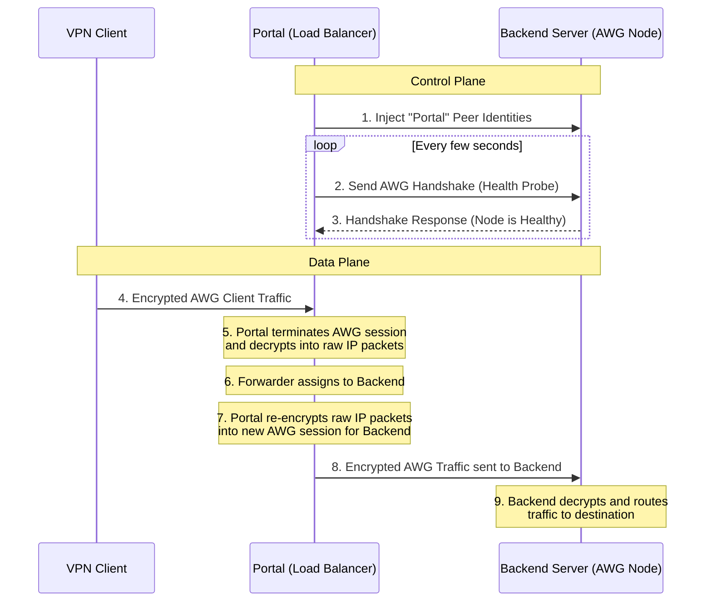

# Load Balancing Architecture

This document explains the Load Balancing architecture in Amnezia Nexus and how traffic is processed.

## How it Works

Your assumption: *"the portal creates a config file on remote backend for itself, then uses this config file to connect to backend server and route traffic to it."*

This is **mostly correct**, with a few nuanced details about how the Portal acts as a "Man-in-the-Middle" reverse proxy, meaning it terminates the VPN connection itself rather than just blindly passing encrypted packets to the backends.

### 1. The Control Plane (Registration & Health Probes)
The Portal securely connects to the backend database and injects AmneziaWG peer identities for itself (e.g., `"Health Probe"` and `"Portal Data Plane"`). 
The Portal uses these cryptographic identities to:
- Send continuous handshake initiation packets to the backend to verify that it is alive and responsive. 
- Authenticate its own data-plane tunnels.

### 2. The Data Plane (Client Traffic)
When a user connects to your VPN, the following sequence occurs:
1. **Ingress**: The client connects directly to the Portal's UDP listener (e.g., port `51820`).
2. **Termination (Decryption)**: The Portal acts as a full AmneziaWG server. It validates the client's handshake, establishes a Noise session, and **decrypts** the incoming traffic, extracting the raw internal IP datagrams.
3. **Forwarding**: The `forwarder` module looks up which backend server the client is assigned to (e.g., using Least Connections or Sticky Sessions) and routes the internal IP packet to that backend's virtual device queue.
4. **Egress (Re-encryption)**: The Portal acts as a full AmneziaWG **client** toward the backend. It takes the raw IP packet, encrypts it into a *new* AmneziaWG transport packet (using the `"Portal Data Plane"` identity parameters), and sends it to the backend server.
5. **Backend Processing**: The remote backend server receives the valid AmneziaWG packet from the Portal, decrypts it, and routes the IP traffic out to the internet (or private subnet).

*(Note: Prior to the recent "Batch 2b" update, step 4 was incomplete and the portal forwarded unencrypted IP packets, which the backends dropped. With Batch 2b deployed, full re-encryption is now active).*

---

## Architectural Diagram

